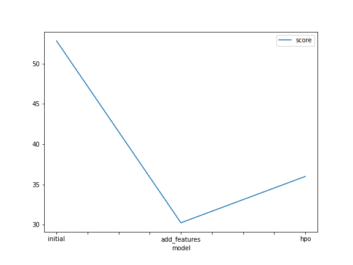
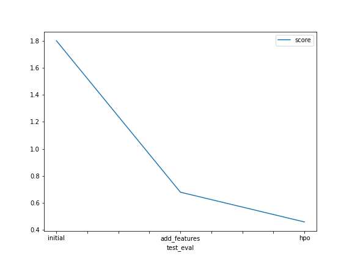

# Report: Predict Bike Sharing Demand with AutoGluon Solution
#### 

## Initial Training
### What did you realize when you tried to submit your predictions? What changes were needed to the output of the predictor to submit your results?
* negative values (a negative number of bike customers is impossible, therefore once this happens due to bad predictions, negative preditions needed to been replaced with 0).

### What was the top ranked model that performed?
* a weighted ensemble with a three layer stack (L3) produced the best results 

## Exploratory data analysis and feature creation
### What did the exploratory analysis find and how did you add additional features?
There is cevidence in data that matches with intuition:
* people tend not to rent a bike at cold or warm temperatures
* when it's not too windy
* when there is no holiday
* preferable on working days

### How much better did your model preform after adding additional features and why do you think that is?
* `1.80` - `0.68` = `1.12` points in improvement; RMSE has been reduced significantly
* Due to feature engineering, we have more variance in the data which improves the predictions 

## Hyperparameter tuning
### How much better did your model perform after trying different hyperparameters?
* `0.68` - `0.46` = `0.12`
* hyperparameter tuning

### If you were given more time with this dataset, where do you think you would spend more time?
* Outlier detection
* AutoGluon randomly splits the data in training and validation data - this doesn't make sense for time series. It would have been better to have a separate validation dataset in this case.
* There is a lot of room for feature engineering, especially in the time series. This would probably increase performance to a certain point.
* In the future, I would also check the feature importance fort the best model

### Create a table with the models you ran, the hyperparameters modified, and the kaggle score.
|model|hpo1|hpo2|hpo3|score|
|--|--|--|--|--|
|initial|?|?|?|?|
|add_features|?|?|?|?|
|hpo|?|?|?|?|

see 

### Create a line plot showing the top model score for the three (or more) training runs during the project.

TODO: Replace the image below with your own.

### Create a line plot showing the top kaggle score for the three (or more) prediction submissions during the project.

TODO: Replace the image below with your own.

## Summary
* Feature Engineering on time series has an important important on the model's performance
* Ensembled models usually perform good
* There is always room for improvements in hyperparameter tuning search spaces